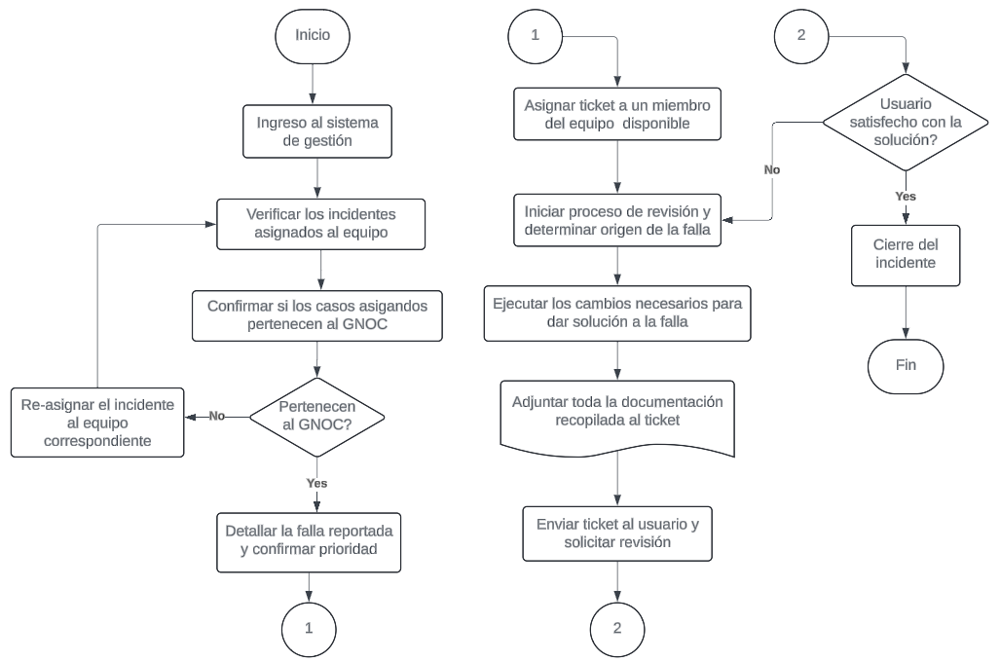

# Tarea 4.2 - Descripción de proceso Jeisson Rodríguez

## GNOC Scotiabank - Ingeniero de Infraestructura

# Identificación del proceso

Descripción del proceso de resolución de problemas relacionados
a la operación de la red del banco Scotiabank en Canadá y a nivel global.

# Análisis del proceso

- Ingreso al sistema de gestión de Incidientes del banco.
- Verificar los incidentes asignados al equipo GNOC.
- Confirmar si los casos creados son relacionados a la operación de la red del banco.
- En caso de no estar relacionado al equipo, se debe actualizar y asignar al equipo correspondiente.
- En caso de estar relacionados, detallar la falla reportada, confirmar prioridad y asignar el ticket a un miembro del equipo.
- Una vez el miembro del equipo reciba la asignación, se debe iniciar el proceso de troubleshooting para determinar el origen de la falla.
- Realizar los cambios y acciones necesarias para dar solución temporal y/o definitiva al incidente reportado.
- Adjuntar toda la evidencia capturada dentro del proceso al respectivo incidente.
- Solicitar la respectiva validación y feedback al usuario que creó la solicitud.
- Confirmar si el usuario está satisfecho con la solución entregada.
- En caso de recibir alguna solicitud adicional, la misma debe ser solucionada y nuevamente confirmar con el usuario.
- Si el usuario da su VoBo a la solución brinda, se debe dar cierre al incidente.

## Diagrama de flujo propuesto para la solución

