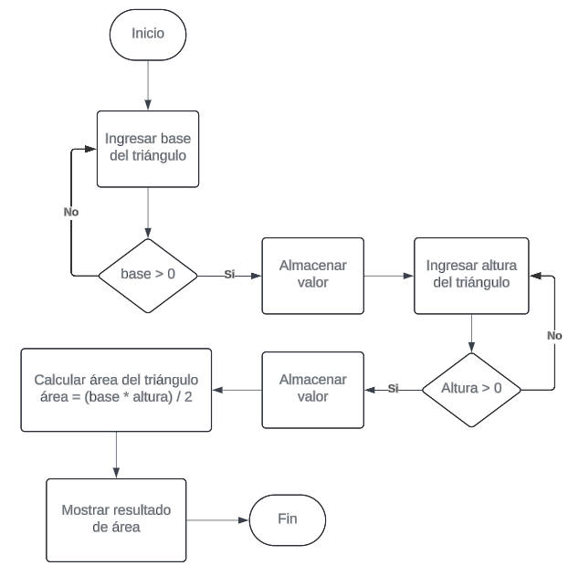

# Tarea 4.1 - Cálculo de área de un triángulo

### Pasos a seguir:

- Solicitar al usuario que ingrese la base del triángulo.
- Solicitar al usuario que ingrese la altura del triángulo.
- Calcular el área del triángulo utilizando la fórmula: área = (base \* altura) / 2.
- Mostrar el resultado al usuario.

### Diagrama de flujo propuesto para la solución

