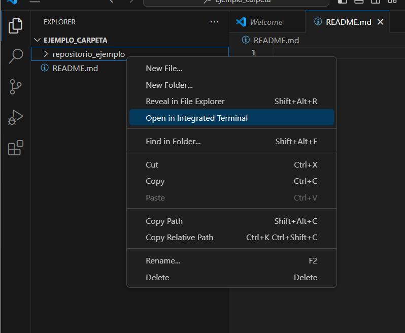
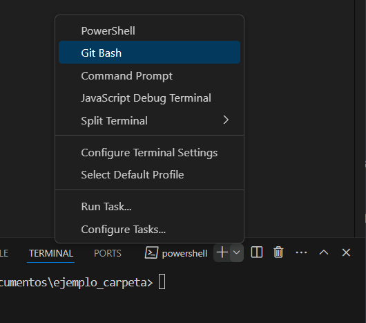

# GIT desde 0

## Introduccion a versionamiento

En la actualidad, cuando el desarrollo web crece a pasos agigantados, crece la ya existente importancia de la clara legibilidad de los codigos y archivos de los proyectos de cientos de miles de desarrolladores a lo largo de nuestro mundo, por ello, haciendo enfasis en el ambito de organizacion del **_versionamiento de archivos_**, su importancia recae en:

    - Limpieza en la linea principal del codigo de un proyecto
    - Control de actualizaciones y cambios realizados 
    - Colaboracion organizada por los miembros de un equipo de desarrolladores
    - Visualizacion correcta del flujo historico del proyecto

A continuacion, explicaremos los comandos e instrucciones para poder hacer buen uso de nuestra herramienta de versionamiento `GIT` en conjunto con el entorno colaborativo `GITHUB`.


## Iniciar repositorio GIT local (Git init)

Para comenzar nuestro camino para entender el funcionamiento de Git, necesitaremos una carpeta vacia que contenga un archivo.
Para nuestro ejemplo utilizaremos un archivo `README.md` sin embargo, se puede utilizar cualquier archivo de preferencia.

Luego, daremos click derecho sobre la carpeta principal sobre la cual queremos crear el repositorio y seleccionaremos la opcion `Open in integrated terminal` tal y como se muestra en la siguiente ilustracion:



Luego de ello se nos desplegara una terminal (por defecto se desplegara en formato `powershell`) en la parte inferior de nuestra pantalla, en ella podremos elejir el tipo de perfil en el que queremos nuestra terminal (Se recomienda elegir la opcion `Git bash` por mejor sitema de marcado de etiquetas para el programador).



A continuacion, escribiremos el comando ***`git init`*** para generar un repositorio en la carpeta seleccionada.

```

Victus@DESKTOP-U4294GK MINGW64 ~/OneDrive/Documentos/ejemplo_carpeta (master)

$ git init
Initialized empty Git repository in C:/Users/Victus/OneDrive/Documentos/ejemplo_carpeta/.git/

```
Liso! has realizado tu primer repositorio Git, ahora, añadamos algunos archivos a el.

## Añadir archivos a un repositorio (git add)
Para empezar a hacer seguimiento a un archivo determinado de nuestro proyecto y, comenzar el proceso de adicion a nuestro repositorio local, por defecto, el archivo aparecera en estado *U* en nuestro Visual Studio (Lo cual significa *Untracked*) como mostramos a continuacion:


Para empezar a "trackear" tus cambios a la fecha en tus archivos y añadirlos a tu repositorio utilizaremos el comando `git add .` en la terminal.

Tu terminal deberia de verse algo similar a la siguiente: 

### Git status

Continuando con el punto anterior, nos abriremos a un nuevo comando que nos permitira ver los archivos pendientes por commit en la rama que deseemos, los archivos no trackeados y ademas los el lugar del repositorio / `path`del repositorio.

Con `Git status` logramos ver todo lo anterior. 
A continuacion, se mostrara en la terminal el estado de los archivos que añadimos previamente con el `Git add`: 

```

$ git status
On branch Jose-David-1019762728
Changes to be committed:
  (use "git restore --staged <file>..." to unstage)
        new file:   Jose_Junco_1019762728/hw_03/image-1.png
        new file:   Jose_Junco_1019762728/hw_03/image-2.png
        new file:   Jose_Junco_1019762728/hw_03/image.png
        new file:   Jose_Junco_1019762728/hw_03/tutorialGit.md
        renamed:    David.md -> Jose_Junco_1019762728/notes.md


```

## Stage de commit (Git commit -m "nota")
El siguiente paso para añadir nuestros archivos a un repositorio local es realizar el comando `Git commit -m "nota"`. De esta manera termina de ser integrado en la rama base de nuestro repositorio. 

luego de que introduzcas este comando tu terminal deberia licuir asi: 

```

$ git commit -m "Actualizacion 01 del tutorial"
[Jose-David-1019762728 1037fb4] Actualizacion 01 del tutorial
 5 files changed, 59 insertions(+)
 create mode 100644 Jose_Junco_1019762728/hw_03/image-1.png
 create mode 100644 Jose_Junco_1019762728/hw_03/image-2.png
 create mode 100644 Jose_Junco_1019762728/hw_03/image.png
 create mode 100644 Jose_Junco_1019762728/hw_03/tutorialGit.md
 rename David.md => Jose_Junco_1019762728/notes.md (100%)

```


    


    
