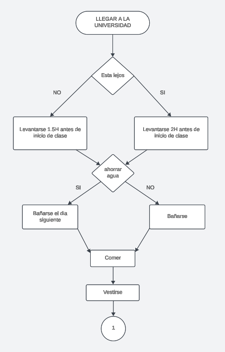
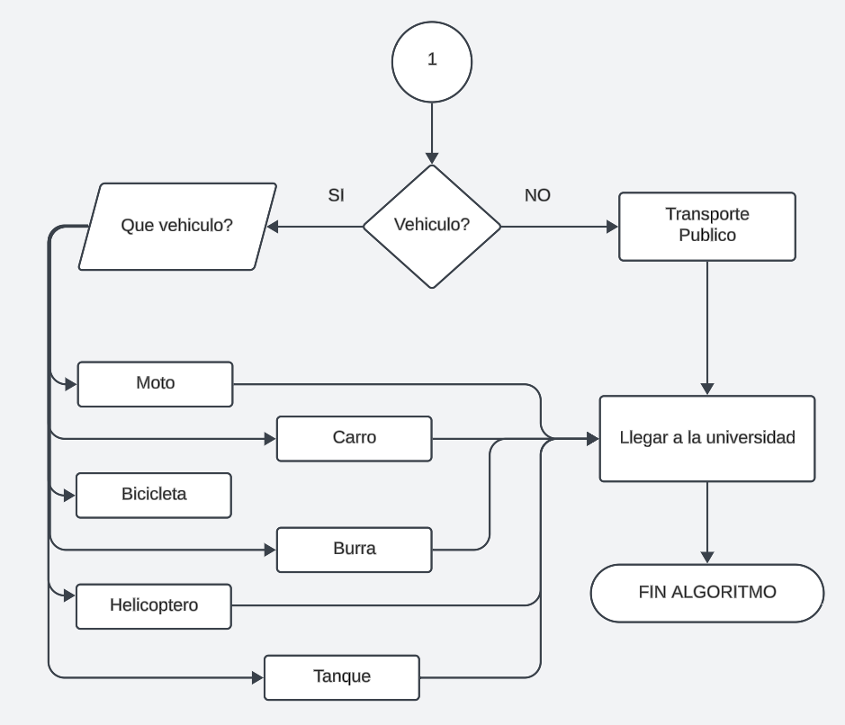

# Accion de un estudiante
## Llegar a la universidad

En el siguiente `diagrama de flujo` se muestra de una forma clara los pasos a grandes rasgos lo necesario para que un universitario pueda `llegar a la Universidad` en condiciones normales.

