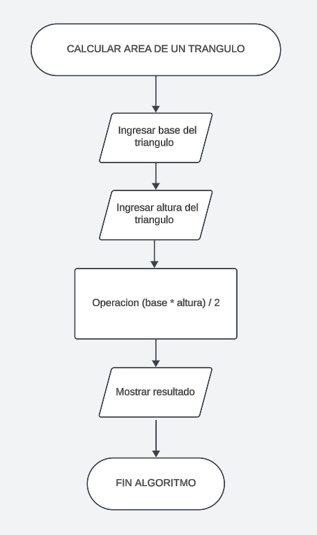

# Area de un triangulo

Para poder crear un algoritmo simple para la formula del ***area de un triangulo***, se ha realizado el siguiente `diagrama de flujo` para una facil comprencion de cualquier tipo de lector.

**Fin**