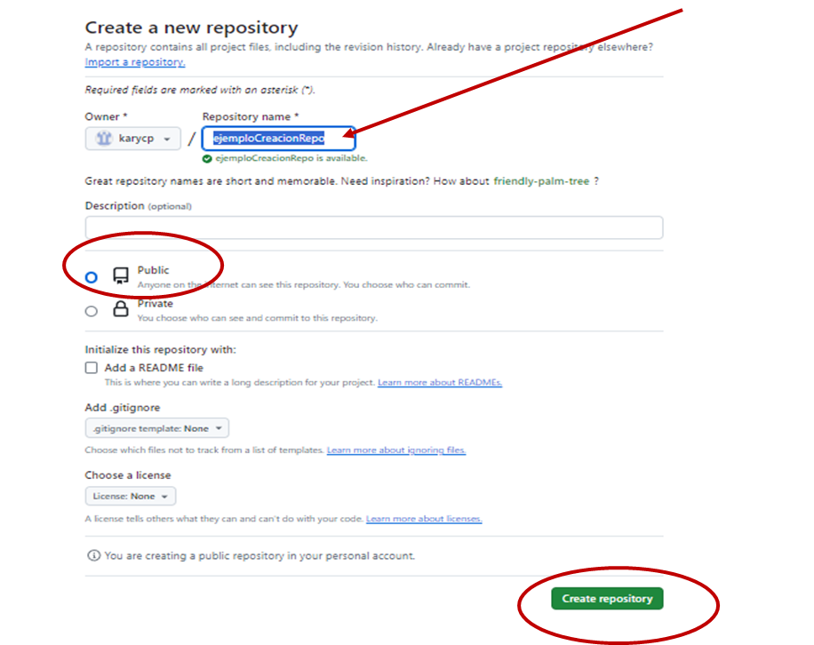
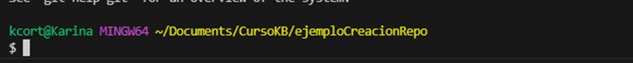

# Inicialización, Agregado y Subida de Archivos a GitHub con Git
### La importancia de versionar archivos en un repositorio se debe a que en él se tiene una copia completa del trabajo o los cambios realizados, también se tiene la posibilidad de realizar trabajo colaborativo, hacer seguimiento a cada proyecto y hacerle mantenimiento al código.
### A continuación se muestra paso a paso el proceso a seguir para lograr crear un repositorio, vincularlo con el entorno local y subir archivos.

### __Siga las Indicaciones dadas a continuación__
1. #### Inicialización de Gitbub
#### Ingrese a la página de Github,  [github.com](http://github.com "github"), e inicie sesión con sus credenciales.
2. #### Haga Clic en su ***Nombre de Usuario*** y Luego en ****Your repositories***


3. #### Haga clic en el botón ***New***


4. #### Luego asígnele un nombre a su repositorio, deje activa la opción ***"Public"*** y haga clic en ***Create Repository***



5. #### Una vez creado el Repositorio, que en este momento está vacío, primero tenga los siguientes comandos: que serán utilizados tanto para inicializar su repositorio como para enlazarlo con su espacio local.


6. #### Ahora va a conectar su Repositorio con su Entorno Local
> - ##### Usando el Explorador de Windows, Cree una Carpeta, si desea déjele el mismo nombre del Repositorio que acabó de crear.

> - #### Desde vbCode va a adicionar la carpeta creada a su espacio de trabajo: Haga Clic en ***File*** y luego en: ***Add Folder*** To Workspace…


> - #### En la ventana que aparece busque su carpeta y posteriormente haga clic en ***Add***

> - #### En Vscode verá algo así:

> - #### Dentro de su Carpeta va a crear un archivo ***README.md***, el cual va a contener información relevante sobre su Proyecto; para esto: Ubíquese sobre su carpeta y haga clic en el siguiente ícono:


> - #### Asígnele el nombre y verá algo así:

> - #### Ahora va a convertir su carpeta en un Repositorio, para que le aparezca en la opción ***Source Control***  que es donde usted observa el trabajo de git relacionado con sus proyectos, para esto:

1. #### Para  enlazar su contenido Local con el contenido de la Nube (***El Repositorio que acabó de crear***): Haga Clic derecho sobre su archivo ***README.md*** y luego clic en la opción ***Open in Integrated Terminal***


2. #### Haga clic en el + que se muestra en la siguiente imagen y luego en la opción GitBash ***(Esto para abrir la consola predeterminada e Iniciar git directamente)*** Finalmente ejecute el comando ```git``` y oprima ENTER.


#### Si todo va bien, observa algo como lo muestra la siguiente imagen, de lo contrario revise los pasos anteriores.


3. #### Para inicializar git, digite el comando ```git init ``` y observe que se inicializa el repositorio y además le crea una Rama, (Espacio de trabajo versiones individual), que en este caso, como el repositorio está vacío, la llama Master.


4. #### En vsCode verifique la opción: ***Source Control***  y observe que el archivo aparece en el estado ***stage*** como ***Untracked*** lo que quiere decir que NO se le está haciendo seguimiento ***(En este momento el archivo no existe ni en su repositorio ni en la nube)***


5.	#### Para cambiar el estado y pasarlo al área de trabajo de Git  ***(staged changes)*** donde quedan en un ambiente a espera de confirmación de cambios, primero revise el estado en el que se encuentran los archivos con el comando  ```git status``` en donde obtiene:


6. #### Observe que existe un archivo con cambios(changes) por guardar y que git le indica cómo cambiar esos archivos al estado ***Staged Changes*** para hacerles seguimiento; para esto use el comando: 
```git add README.md```


7. #### Si observa en su panel izquierdo, notará que el archivo ya cambió de estado a Staged Changes


8. #### Después del estado staged changed debe pasar  al estado de tracked ó de confirmación, el  archivo entra a formar parte del repositorio git; para esto utilice el comando: ```git commit -m “archivo original”``` El Texto entre “” lo define usted pero se sugiere que esté relacionado con los cambios realizados!!


9. #### En este momento el Repositorio está en la nube pero VACIO; para poder trabajar sobre él, tiene que *vincularlo* y para esto, escriba:
```git remote add origin https://github.com/karycp/ejemploCreacionRepo.git```
### (En la dirección anterior encuentra: el dominio de github, su usuario y el nombre de su repositorio), y lo que se está haciendo es agregar a su entrono local, lo que está en esa dirección.
### Finalmente, para enviar los cambios a github escriba:
```Git push origin master```

(Recuerde que master es su rama principal)

# FIN DEL TUTORIAL
