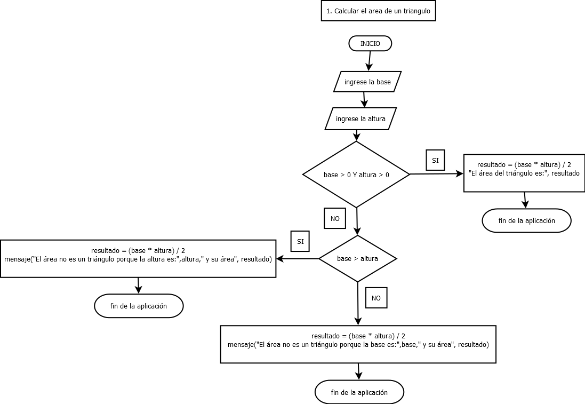
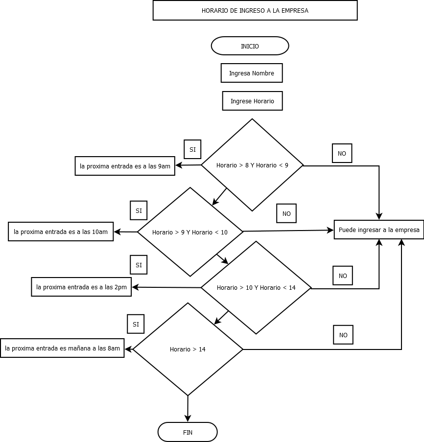

# Tarea 4: Diagramas de flujo
## 1. Calcular el area de un triangulo

<div style="text-align: justify">


```
## Código

 const area = require('readline'); // requiriendo módulo de readline

const triangulo = area.createInterface({  //creado interface de manipulación del salida (stdin ) y entrada (stdout)
    input: process.stdin,       //procedimiento de salida
    output: process.stdout      //procedimiento de entrada  
});

triangulo.question('Ingresa la base: ', (base) => {             // entrada de datos a la variable base
    triangulo.question('Ingresa la altura: ', (altura) => {     // entrada de datos a la variable altura
        
        if (base > 0 && altura > 0) {
            let resultado = (base * altura) / 2;                    // asignación de calculo en la variable resultado base X altura
            console.log("El área del triángulo es:", resultado);    // salida de datos en la variable resultado
            triangulo.close();                                      // finalizando el ciclo de la función 
        }else if(base > altura){
            resultado = (base * altura) / 2;
            console.log("El área no es un triángulo porque la altura es:",altura," y su área", resultado);   // salida de datos en la variable resultado
            triangulo.close();                                      // finalizando el ciclo de la función 
        }else{
            resultado = (base * altura) / 2;
            console.log("El área no es un triángulo porque la base es:",base," y su área ", resultado);   // salida de datos en la variable resultado
            triangulo.close();                                      // finalizando el ciclo de la función 
        }
    });
});
```
</div>



# 2. Creación de Diagrama de Flujo de un Proceso Laboral:

## Horario de ingreso a la empresa

***EEl ingreso a laborar a la empresa es a las 8:00 am, si el funcionario se pasa un minuto la puerta se cierra hasta las 9:00am, si el funcionario se pasa un minuto la puerta se cierra hasta las 10:00am, si el funcionario se pasa más de un minuto la puerta se cierra hasta las 14:00pm, si se pasa un minuto se cierra hasta el otro día:***
```
const entrada = require('readline'); // requiriendo módulo de readline

const ingreso = entrada.createInterface({  //creado interface de manipulación del salida (stdin ) y entrada (stdout)
    input: process.stdin,       //procedimiento de salida
    output: process.stdout      //procedimiento de entrada  
});

ingreso.question('Ingresa Nombre: ', (Nombre) => {             // entrada de datos a la variable base
    ingreso.question('Ingrese Horario: ', (Horario) => {     // entrada de datos a la variable altura
        console.log(Horario);
        if (Horario > 8 && Horario < 9) {
            console.log(Nombre, "la proxima entrada es a las 9am, lo siento su hora es", Horario); 
            ingreso.close();                                       
        }else if(Horario > 9 && Horario < 10){
            console.log(Nombre, "la proxima entrada es a las 10am, lo siento su hora es", Horario);  
            ingreso.close();                                       
        }else if(Horario > 10 && Horario < 14){
            console.log(Nombre, "la proxima entrada es a las 2pm, lo siento su hora es", Horario);   
            ingreso.close();                                       
        }else if (Horario > 14){
            console.log(Nombre, "la proxima entrada es mañana a las 8am, lo siento su hora es", Horario); 
            ingreso.close();  
        }else{
            console.log(Nombre, "Puede ingresar a la empresa, ha llegado a tiempo", Horario);   
            ingreso.close();
        }
    });
});
```
