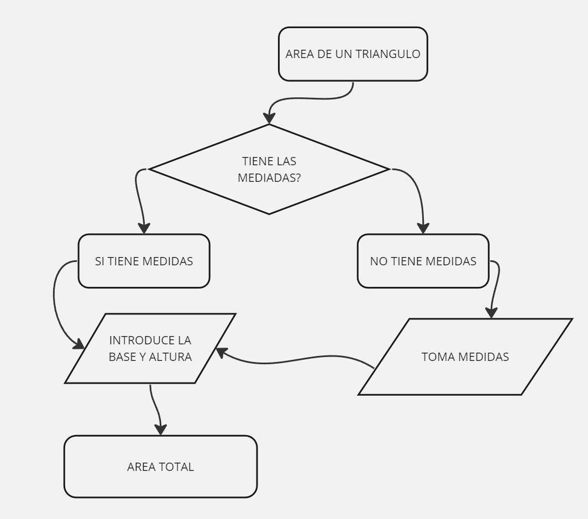

# tarea de clase 4

## Calculaer el area de un trangulo.

1. El usuario entrega una medida que como base.
2. luego introduce la altura.

3. para clacular el *area* del tringulo tomamos el la base por la altura y lo multiplicamos y luego hacemos una division.

4. Atravez de una impresión en pantalla le decimos al usurio el **area total**.

### Este es el primer codigo.

const areaTriangulo = require('readline');

const area = areaTriangulo.createInterface({
    input: process.stdin,
    output: process.stdout
});

area.question('Ingresa la base del triángulo: ', (base) => {
    area.question('Ingresa la altura del triángulo: ', (altura) => {
        const areaTotal = (base * altura) / 2;
        console.log("El área del triángulo es:", areaTotal);
        area.close(); // Cierra la interfaz de lectura de línea
    });
});

# TRABAJO DE CLASE 4 NUMERO 2

### COMO HACER EL QUESO.

1. Para producir el queso se nesecita tener los ingredientes, leche baldes, jarras, cucharones, cedasos, pasta de cuajo.
2. Se prepara los utencilios bien limpios.
3. Colocar la leche en el recipiente que preparamos.
4. Agregamos la pasta de cuajar.
5. Mesclar muy bien y dejar en reposo por un determinado tiempo.
6. Cortar la leche para separar del suero hasta dejar el queso en una masa blanda.
7. mesclar con un conservante y agregar sal.
8. Llevar al molde y presionar para obtemer una masa compacta.
9. enpacar y almacenar para la maduracio.

Trabajo realizado por:

## jorje_tonguino_87453688

