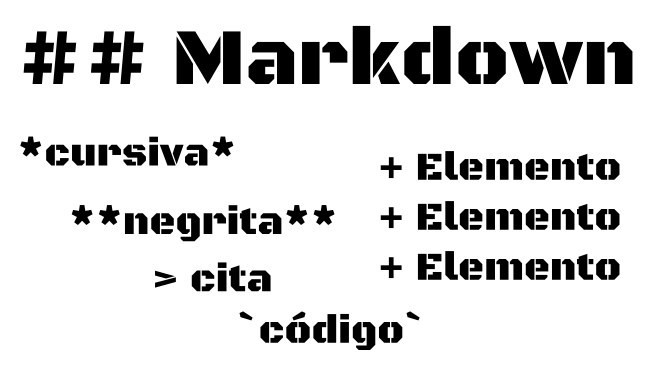

# Nombre: JORGE_LEONEL_TONGUINO_PANTOJA

*Es iportanate trabajar sete tutorial por que nos ayuda para un previo repaso de lo aprendido en clase*

# Tarea clase 3

- En este tutorial que realizare donde  estare dando a conocer como trabajaria el Markdown en mis conocimiento adquiridos en mi clase tres.

# Para el tittulo grande en Markdown se utlisa una almoadilla de la siguiente forma 
De esta manera reemplazo el encabezado de html y dependiendo el nivel se aplica el amoadilla (#).

- Aqui tambien mostrare la lista ordenada que utlizamos, el numero y un punto (1.) para originar una lista ordenada.

## Lista ordenada.
La lista ordenada se crea reemplasando el ol y el li de html
    Tambien le puedo crear subpuntos en el punto utilizando espaciados. (1.) Ej.

1. (#) una almoadilla es h1
    1. Titulo.(#)
        1. subtitulo.(##)
            1. Nivel tres (###) 
    2. nivel seis (######)
2. (##) una almoadilla es h2
3. (###) una almoadilla es h3
4. (####) una almoadilla es h4
5. (#####) una almoadilla es h5
6. (######) una almoadilla es h6

## Lista desordenada.
La lista desordenada se crea reemplasando el ul y el li de html

### Un brebe ejemplo.

En la lista desordenada podemos sacar subpunto Ej.
- ave
- Arbol.
    - Hojas.
    - Ramas.
        - Flor.
        - Frutos.
    - Tallo.
    - Raiz.
- Cuadrupedo.
- Mamifero.

#### Palabras curcibas.

Utilizamos una palabra en medio de dos astediscos (* *)

1. *Jorge leonel*
2. *Jose Ricardo*

#### Palabras en negrilla.

Este es un **recuento** del trabajo en negrilla Ej. **Raciomaniento del agua**

## tambienla puedo hacer negrita y curciba.

Aplico tres astediscos asi (*** ***)

Me llamo ***Jorge Leonel*** estudio desarrollo ***WEB***

##### Palabras ~~tachadas~~

Una forma de hacer que en Markdown se tache, en el tecldo de Window que es mi pc lo hago asi (alt+126) y me sale el simbolo virgulilla (~) este simbolo le da sonido a la (Ñ), lo aplico dos veses antes y despues de cada palabra o texto asi:  
hola mumdo ~~hola mundo~~ 
hola ~~hola~~ 
mundo ~~mundo~~

###### crear una tabla en markdown.

se crea utilizando este simbolo llamada pleca (|).

| Nombre | Apellido | Edad |
|--------|----------|------|
| Jorge  | leonel   | 46   |
| Jorge  | leonel   | 46   |
| Jorge  | leonel   | 46   |
| Jorge  | leonel   | 46   |

## Tambien se maneja el tema de imagenes. 

Una imagen se crea utilzando esta formula.

 corchete cuadrado descripcion, parentesis url; de la imagen ej.

Nota. como ves utilizare un titulo y un lineado.

|markdown| 
|--------|

Este trabajo lo realice como presentacion a mi tarea, espero quien lo mire le saque probecho feliz dia.

