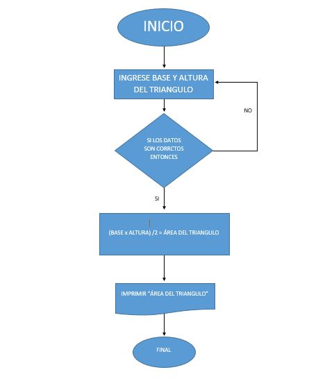
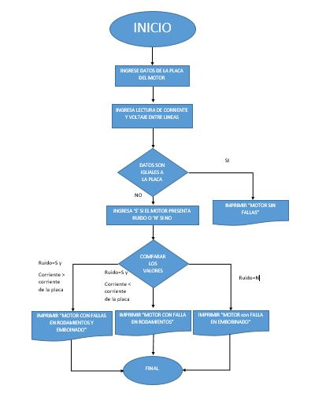

# Tarea #3

Diagramas de flujo.

## 1. Calcular el área de un triangulo

### Pasos a seguir:

- Solicitar al usuario que ingrese la base del triángulo.
- Solicitar al usuario que ingrese la altura del triángulo.
- Calcular el área del triángulo utilizando la fórmula: área = (base \* altura) / 2.
- Mostrar el resultado al usuario.

### Diagrama de flujo

## 2. Detección de fallas en un motor

### Pasos a seguir:

- Solicitar al usuario que ingrese los datos de la placa del motor.
- Solicitar al usuario que tome lecturas de corriente, voltaje entre lineas y las ingrese en el programa. 
- Si los valores no son iguales a los de la placa, entonces, preguntar al usuario si hay algun ruido inusual en el motor, si no, imprimir motor sin fallas.
- Si el usuario ingresa que presenta ruido y el valor de corriente es mayor al de la placa imprimir falla en rodamientos y embobinado. si presenta ruido y valor de corriente menor o igual a la placa imprimir falla en rodamientos, si el motor no presenta ruido y su valor de corriente es mayor al de la placa imprimir falla de embobinado.

### Diagrama de flujo

